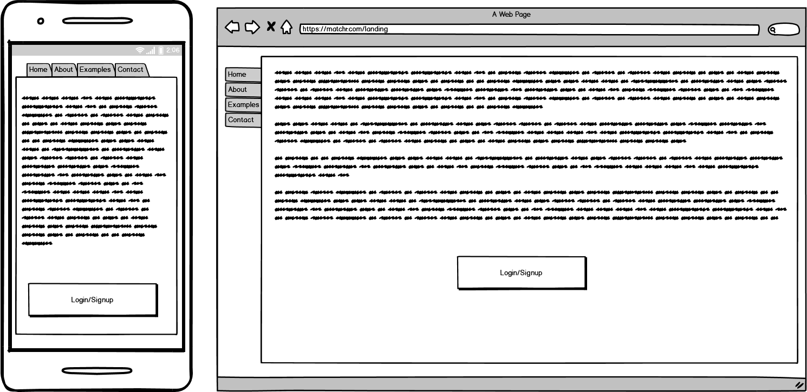
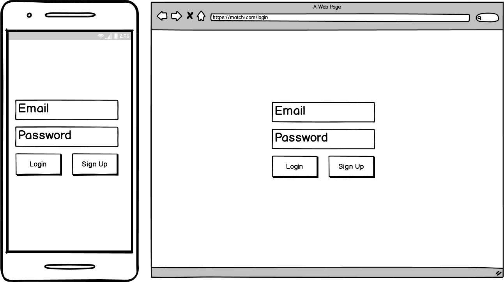
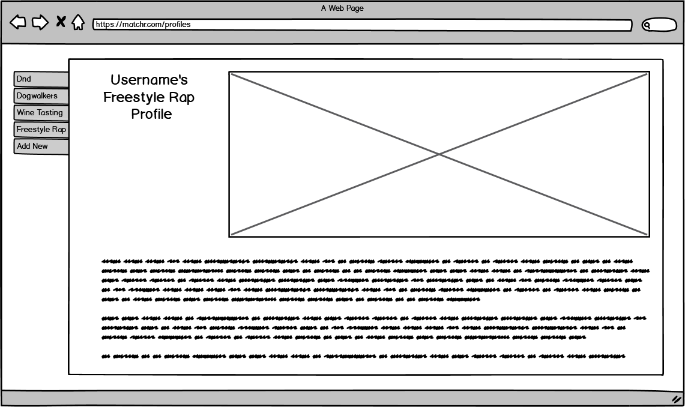
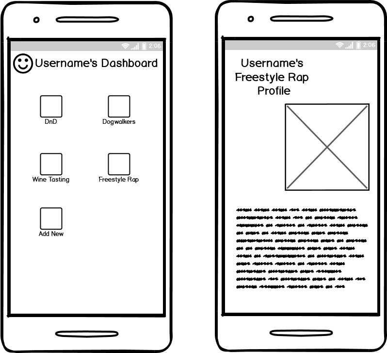
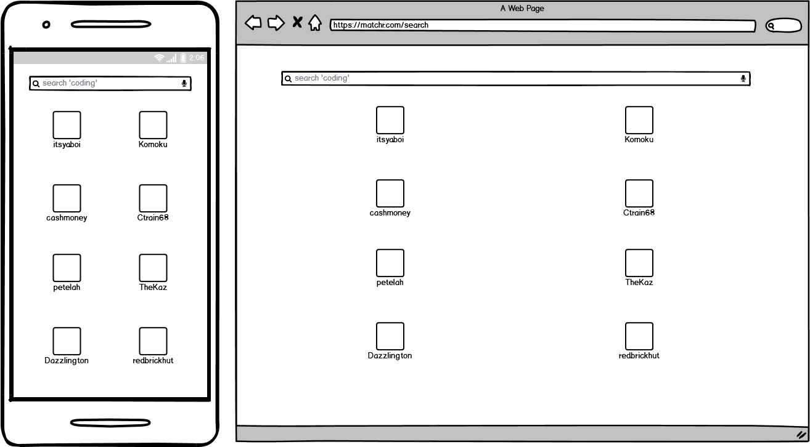
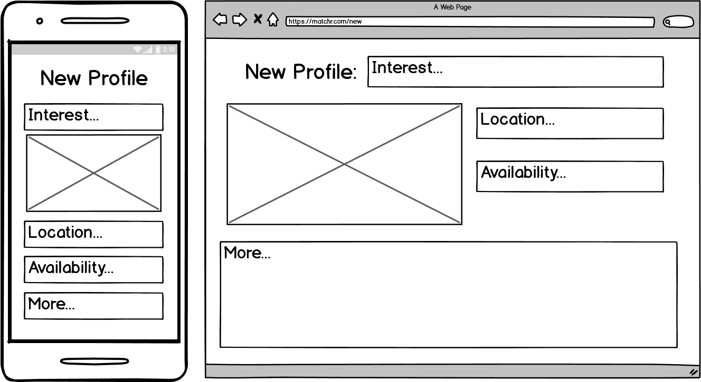
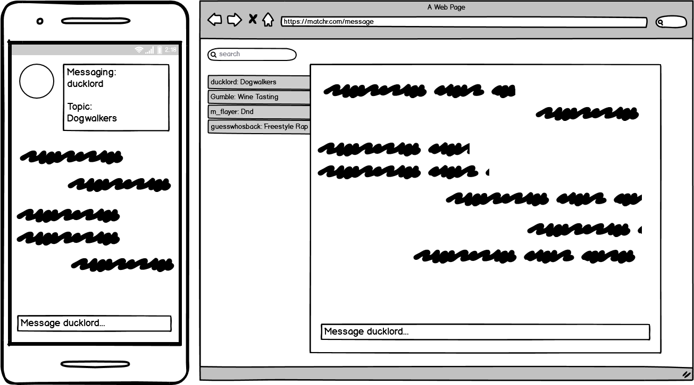

# Matchr  
###### until I come up with a better name

---  

### [Link to Trello Board](https://trello.com/b/o4qKxzxZ/matchr)  

---  

### Description  

__*'You should make Tinder for forming Dungeons and Dragons groups'*__  

__*'Could you make Tinder for dogs?'*__  

This app aims to facilitate matching people and groups of like minded people based on interest.  
Users will be able to create distinct profiles for each of their hobbies in order to find other similar users.  

Profiles will include a short description outlining a user's story within an interest and provide details on their:
- Location
- Time Availabilities
- Intensity (e.g. casual/hardcore)

---  

### Installation Steps

This app is written in Python 3.8, which can be installed (along with its related packages) on Unix like systems using:  
```bash
apt-get install python3.8 python3.8-venv python3-pip
```  

To clone a fresh copy of the repo, use the command:  
```bash
git clone https://github.com/eric-chew/matchr
```  

Then change your current working directory into the project:  
```bash
cd matchr
```  

Initialise a virtual environment:  
```bash
python3.8 -m venv venv
```  

Then activate the virtual environment:  
```bash
source venv/bin/activate
```  

Install the required dependencies:  
```bash
pip3 install -r requirements.txt
```  

Then you can run the app:
```bash
python src/main.py
```  

---

### Wireframes  

##### Landing Page  

Entry point to the application, contains a brief description of the app with an example profile to demo the app.  
Background is a collage of various interesrs to show that anything can be a profile.  

  

##### Login/Signup  

User enters credentials here to login (if their account already exists) or sign up (for new users).  

  

##### Dashboard and Profiles (Desktop)  

On desktop, the app allows the user's profiles to be viewed from the sidebar with the main window showing the contents of the profile.

  

##### Dashboard and Profiles (Mobile)  

On mobile, the dashboard containing a list of the user's profiles is seperate from each page.  

  

##### Search Profiles  

Users can search for other users who share an interest with them.  

  

##### Add Profile  

Users can create profiles for their interests.  
Profiles contain information to help facilitate batter matches (e.g. location and schedules).  

  

##### Messaging  

Users can message others they've connected with to further discuss either interest and potentially organise meetings.

  

